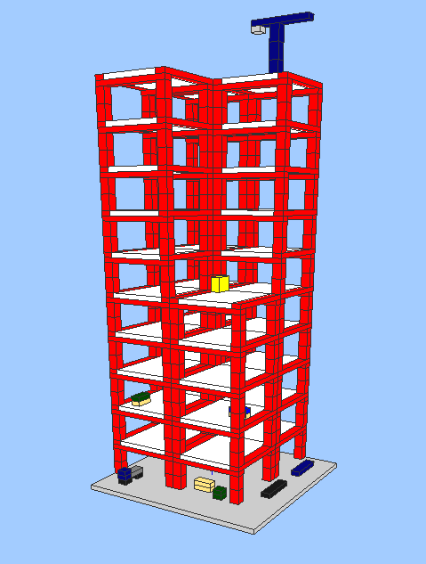

# GLBRIX

This program is an editor for 3-dimensional bricks. The bricks are
inspired by LEGO bricks, but the aim of this project is not to be an
editor for such bricks in particular.

For now it is in prototype stage, so it is very much under
construction.

The picture is a screenshot from a model built with this program.

# Building and running

You need OpenGL and GLUT.

You also need the stack tool [stack](haskellstack.org) to build this.
  
Clone this project and enter the project dir.

Then run this to build and then run program:

	stack build --exec glbrix

## Installing

To install the program, run this:

	stack install

and you will get a binary.

# Usage

`Left click` to place part or select/deselect part.

`Mouse wheel` to zoom in/out.

`Right mouse btn + move` to rotate camera.

`Arrow keys` moves selected parts one step in each direction.

## Commands

Currently there is no GUI components except the editor, so you need to
enter commands by keyboard. The available commands are listed
below.

  * `p <width> x <height>` to insert a new plate.

  * `b <width> x <height>` to insert a new brick.

  * `c <color>` to change current color. Available colors are listed below.

  * `r` rotate selected parts 90 degrees.

  * `[ESC]` to abort the current edit operation and clear the command buffer.

  * `[SPACEBAR]` to clone selected parts.

Example:

Typing `b4x2` will insert a new brick of 4x2 dimension

## Color codes

These are likely to change:

  * `b` blue, `B` dark blue
  * `e` grey, `E` dark grey
  * `g` green, `G` dark green
  * `k` black
  * `l` light blue
  * `r` red
  * `t` tan
  * `w` white
  * `y` yellow

# Implementation

So much to do! I am really new to lenses and not good at OpenGL, so...
